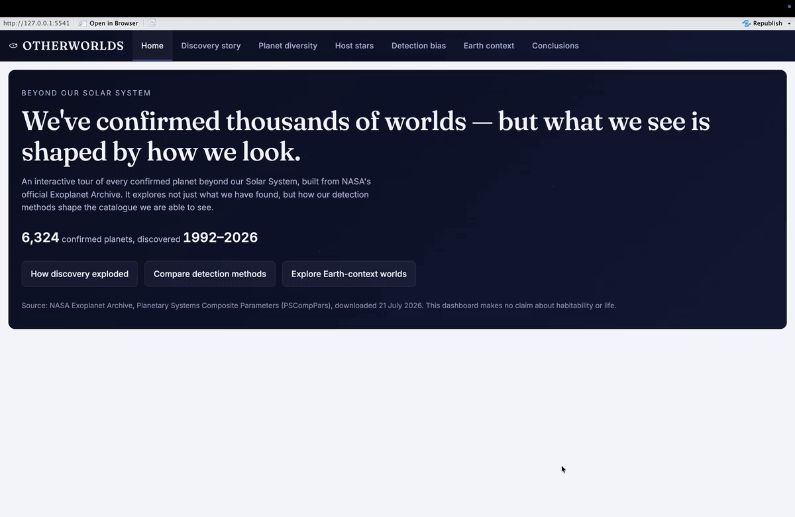

# 🪐 Otherworlds — Exoplanet Explorer

[](https://github.com/OWNER/REPO/actions/workflows/ci.yml)

[](LICENSE)
[](https://YOUR-APP.shinyapps.io/otherworlds)

> An interactive **R Shiny** dashboard exploring how our *detection methods* shape what we know about the 6,300+ confirmed planets beyond our Solar System — built for a non-technical audience, with every design choice defensible.

**▶ [Try it live](https://YOUR-APP.shinyapps.io/otherworlds)** &nbsp;·&nbsp; built with R · Shiny · ggplot2 · Plotly



---

## The idea

We've confirmed thousands of exoplanets — but the catalogue isn't a neutral census of what's out there. It's a portrait of **what our instruments can see**. Space-based transit surveys like Kepler favour large planets on short orbits; radial velocity finds a different population again. *Otherworlds* makes that selection effect visible and explorable, without ever overclaiming (no habitability hype).

Four questions you can explore interactively:

- **How did discovery explode over time**, and which methods drove each surge?
- **How diverse are these worlds** in size, mass and orbital period?
- **What kinds of stars host them** — and how many planets per system?
- **Which "Earth-context" worlds** match a size / temperature / distance filter (and why that says nothing about habitability)?

## Why it's worth a look — engineering highlights

Originally an individual MSc project, refactored into this portfolio version. A few things I'm proud of:

- **Accessibility done properly, not bolted on** — screen-reader summaries, `aria-live` status messages, keyboard-friendly controls, and a colourblind-safe palette (Okabe–Ito) whose contrast ratios are *measured against WCAG thresholds*, not eyeballed.
- **One shared visual language** — all ten charts pass through a single `as_interactive()` treatment, so every toolbar, font, hover label and source caption is identical. Change it once, it changes everywhere.
- **Honest data handling** — plot-specific complete cases (each chart uses only the planets that actually have the value it needs), self-explaining empty states instead of red errors, and captions that state the selection-bias caveat in plain English.
- **Reproducible pipeline** — one idempotent script rebuilds the curated 20-variable dataset from the raw NASA export, and only when the raw file changes.
- **Performance-minded reactivity** — debounced global filters and per-chart caching (`bindCache`) so dragging a slider doesn't redraw the whole app.
- **Tested + CI** — a `testthat` suite (data contract, summary logic, and every chart builder) runs on GitHub Actions on every push.

## Built with

**R**, **Shiny**, **ggplot2**, **Plotly**, **DT**, dplyr, readr, forcats, scales, and showtext/sysfonts. Inter & Fraunces fonts are bundled locally, so the app makes **no runtime web-font calls** and renders identically offline.

## Run it locally

Requires **R 4.1+** (RStudio recommended but not required).

```r
install.packages(c(
  "shiny", "dplyr", "readr", "ggplot2", "scales", "forcats",
  "plotly", "DT", "sysfonts", "showtext", "cachem"
))

shiny::runApp()   # from the project folder
```

The app ships with both the raw and processed data, so it runs **offline with no downloads**.

Prefer not to install anything? **[Try the live version.](https://YOUR-APP.shinyapps.io/otherworlds)**

### 60-second tour

1. Open **Discovery story** → click **Kepler** under Quick eras and watch the timeline and method mix update.
2. Toggle **Annual ↔ Cumulative**.
3. On **Planet diversity**, hover any point in the radius–period scatter to inspect a single planet.
4. On **Earth context**, drag the radius / temperature sliders and watch the summary, chart and table move together — then read the caveat.

## Tests

```r
install.packages("testthat")
testthat::test_dir("tests/testthat")
```

The same suite runs in CI on every push — see the badge at the top.

## Project structure

```text
individual_dashboard/
├── app.R                      # UI + server (navbarPage shell, shared filter rail)
├── R/
│   ├── 01_prepare_data.R      # idempotent raw → processed pipeline
│   ├── 02_plot_helpers.R      # theme, palette, chart builders, as_interactive()
│   └── 03_text_helpers.R      # reactive summary-sentence logic
├── data/
│   ├── raw/       PSCompPars_2026.07.21_16.45.43.csv   # NASA export (unmodified)
│   └── processed/ exoplanets_dashboard.csv             # 6,324 × 20 curated
├── tests/testthat/            # data-contract, text and chart-builder tests
├── www/
│   ├── custom.css             # design system (tokens, layout, components)
│   └── fonts/                 # bundled Inter + Fraunces (SIL OFL)
├── .github/workflows/ci.yml   # runs the test suite on every push
├── LICENSE                    # MIT
└── README.md
```

## Data & attribution

Source: the **NASA Exoplanet Archive**, Planetary Systems Composite Parameters (PSCompPars) — a snapshot of 6,324 confirmed planets downloaded **21 July 2026**. This is public, open data, included here with attribution:

> NASA Exoplanet Archive, *Planetary Systems Composite Parameters* (PSCompPars), Caltech/IPAC. DOI: [10.26133/NEA13](https://doi.org/10.26133/NEA13). Accessed 21 July 2026.

The dashboard describes the **detected and confirmed** catalogue. It is not a census of every planet that exists, and it makes **no claim about habitability or life**.

## Context

Built solo as an individual project for a postgraduate **Applied Analytics** module (MSc, Queen's University Belfast), then polished into this portfolio version.

## License

Released under the **MIT License** — see [LICENSE](LICENSE).
